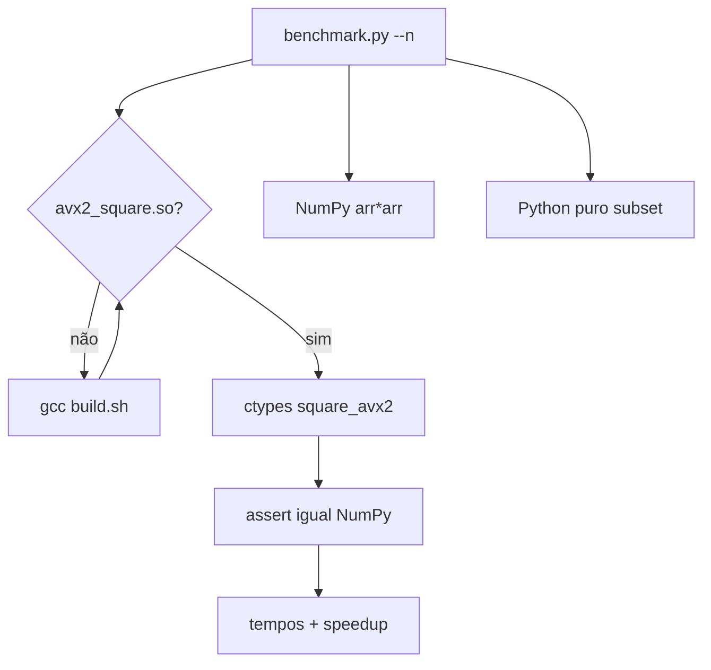

# ⚡ avx2-benchmark-ctypes — AVX2 via ctypes vs NumPy
<p align="center">
  
  <a href="https://github.com/panda12332145/avx2-benchmark-ctypes/commits/main"></a>
  <a href="https://github.com/panda12332145/avx2-benchmark-ctypes"></a>
  
</p>
---
## 🔖 Resumo

**Benchmark educacional** de SIMD: um lib `.so/.dll` em **C com intrínsecos AVX2** (`_mm256_mullo_epi32`) carregado por **ctypes**, comparado com **NumPy** e **Python puro** no mesmo vetor. Inclui `build.sh`/`build.bat` com detecção de suporte a AVX2, **fallback escalar** via `#ifdef __AVX2__`, auto-compilação pelo runner e verificação de corretude contra NumPy antes de cronometrar.

### ✨ Funcionalidades Principais

- ✅ C com intrínsecos AVX2 (8×int32 por iteração) + resto escalar
- ✅ Fallback automático se compilado sem AVX2 (portabilidade)
- ✅ Runner auto-compila com `gcc` quando a lib não existe
- ✅ Verificação de corretude vs NumPy em 6 tamanhos (inclui N não múltiplo de 8)
- ✅ 3 camadas: ctypes AVX2 → NumPy → Python puro (extrapolado)
- ✅ `--n`/`--repeats`/`--no-lib` no CLI

## 📽 Demonstração

```text
$ python benchmark.py --n 1000000
[+] Biblioteca carregada: avx2_square.so
✅ Corretude AVX2 vs NumPy: ok
⏱️  AVX2 (ctypes):  0.001203s
⏱️  NumPy:          0.001451s
🚀 AVX2 via ctypes é 1.21× mais rápido que NumPy nesta execução
```

## ⚙️ Explicação das Partes Importantes

### O kernel AVX2 (`avx2_square.c`)

```c
#ifdef __AVX2__
    for (; i + 8 <= n; i += 8) {
        __m256i v = _mm256_loadu_si256((const __m256i *)(in + i));
        _mm256_storeu_si256((__m256i *)(out + i),
                            _mm256_mullo_epi32(v, v));
    }
#endif
    for (; i < n; i++) out[i] = in[i] * in[i];   // resto escalar
```

> 8 int32 multiplicados por clock de vetor; o loop de resto garante N quaisquer (o teste cobre N=7,9,100003).

### Auto-build do runner

```python
def try_build():
    if shutil.which("gcc"):
        subprocess.run(["bash", "build.sh"], check=False)
    return find_lib()   # None → só NumPy/Python, sem quebrar
```

> Zero-fricção: clonou, tem gcc → já compila e bencha; sem gcc → degrada elegante.

## 🔄 Fluxo de Trabalho / Arquitetura



## 📂 Estrutura do Projeto

```plaintext
avx2-benchmark-ctypes/
├── avx2_square.c         # kernel AVX2 + fallback escalar
├── build.sh / build.bat  # gcc -mavx2 -shared (.so/.dll)
├── benchmark.py          # runner: load → corretude → timing
├── tests/test_benchmark.py  # 3 testes (compila de verdade)
├── requirements.txt      # numpy
└── README.md
```

## 🛠️ Tecnologias

| Ferramenta | Uso |
|---|---|
| **C + GCC** | Kernel SIMD |
| **AVX2** | _mm256_mullo_epi32 (8×int32) |
| **ctypes** | FFI sem compilação extra |
| **NumPy** | Linha de base |

## ▶️ Instalação

```bash
git clone https://github.com/panda12332145/avx2-benchmark-ctypes.git
cd avx2-benchmark-ctypes
pip install -r requirements.txt
./build.sh                # gera avx2_square.so
# Windows: build.bat      # gera avx2_square.dll
```

## 🚀 Execução

```bash
python benchmark.py                  # N=1.000.000
python benchmark.py --n 10000000     # N maior
python benchmark.py --no-lib         # só NumPy/Python
python benchmark.py --repeats 10

# Testes (compila + valida vs NumPy):
python tests/test_benchmark.py
```

## 🧪 Testes

3 testes automatizados: build real com gcc + corretude em 6 tamanhos (1,7,8,9,1000,100003 — inclui não múltiplos de 8), `--help` do runner e execução completa com N=5000.

## ⚠️ Limitações

- Squaring int32 apenas (operador por propósito didático)
- NumPy vence em N pequenos (overhead do ctypes/FFI)
- AVX2/AVX-512 — o binário não usa funções VEX antigas

## 🚀 Roadmap

- [ ] Operadores extras (soma/xor via AVX2)
- [ ] Benchmark com numpy.show_config/threads
- [ ] Versão AVX-512 condicional

## 📄 Licença

Todos os direitos reservados ao autor.

---

## 👾 Autor

<p align="center">
  
</p>

<p align="center">Feito por <strong>Panda12332145</strong> 👋🏽</p>

---

## 🧑‍💻 Sobre Mim

Sou apaixonado por **Física Teórica, Cibersegurança e Desenvolvimento de Sistemas**. Tenho grande interesse em programação de baixo nível, engenharia reversa, automação, sistemas Windows, criptografia e segurança ofensiva. Também gosto bastante de música, filosofia e computação avançada.

---

## 🌐 Redes

* **Site:** [https://panda-h0me.netlify.app/](https://panda-h0me.netlify.app/)
* **YouTube:** [https://www.youtube.com/@X86BinaryGhost](https://www.youtube.com/@X86BinaryGhost)
* **Instagram:** [https://www.instagram.com/01pandal10/](https://www.instagram.com/01pandal10/)
* **GitHub:** [https://github.com/panda12332145](https://github.com/panda12332145)
* **LinkedIn:** [linkedin.com/in/athos-da-boanergis](https://www.linkedin.com/in/athos-d%C3%A3-boanergis-5585a4288/)

---

## 🚀 Áreas de Interesse

* **Cibersegurança Avançada** 🔒
* **Hacking & Engenharia Reversa** 💻
* **Computação de Baixo Nível** 🖥️
* **Matemática e Física Teórica** 📐⚛️
* **Desenvolvimento de Ferramentas de Segurança** 🛠️

_"Conhecimento é poder, e domínio técnico vem da compreensão profunda dos sistemas."_

---

## 📞 Contato & Suporte

Para colaborações, dúvidas ou sugestões:

📧 **E-mail:** [athos.cybersec@gmail.com](mailto:athos.cybersec@gmail.com)

🐛 **Reportar Bug:** [Abrir Issue](https://github.com/panda12332145/avx2-benchmark-ctypes/issues)

💡 **Sugerir Melhoria:** [Discussions](https://github.com/panda12332145/avx2-benchmark-ctypes/discussions)
